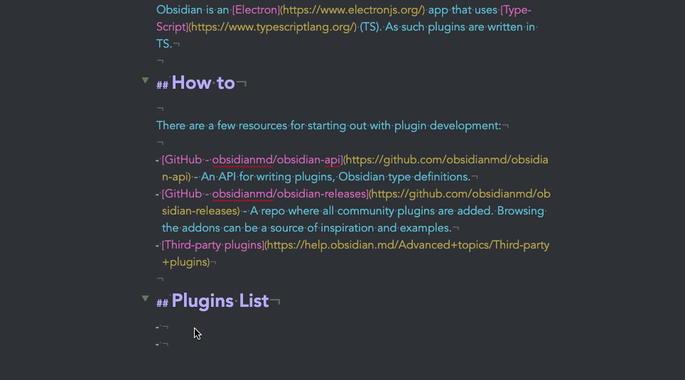

# Auto Link Title Plugin for Obsidian

`auto-link-title-obsidian`

Pasting a link into Obsidian formats, it fetches and adds its title.

Inspired by: https://github.com/denolehov/obsidian-url-into-selection

## Behaviour
- If the link is **not** a web page, the link is used as the title. (ex: adding a link to a PDF file)
- If an error occurs, the link is used as the title.

## Drawbacks

To get the page title, the plugin needs to fetch the **full** page. In practice, there might be significant lag when pasting, depending on the page's size and your connection.

## Default Keybind

`CTRL + CMD + V`

You _could_ also use `CMD + V` to "augment" the default behaviour when pasting and always fetch titles for links.
